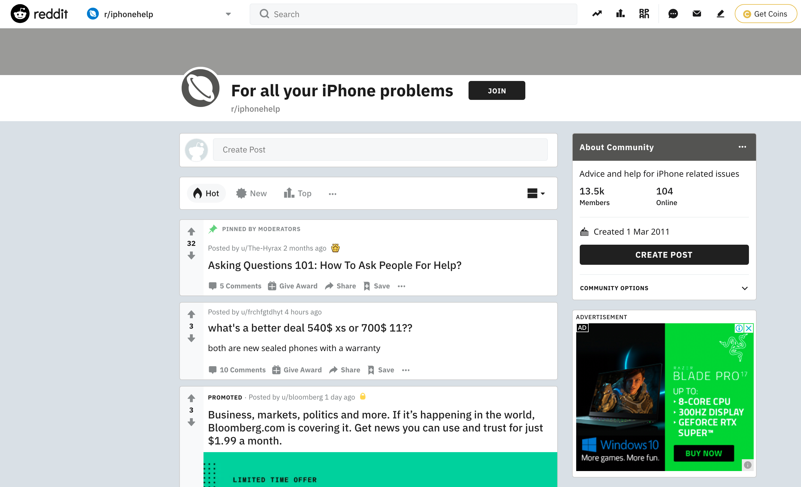

### Project 3 - Subreddit Classification
---
Reddit is a popular social news, content, and discussions website where posts are organised according to subject into user-created 'subreddits'. Members submit content (such as images, texts, and links) to subreddits, which can then be voted on and commented by other members, creating an internet community of sorts around specific themes. 

In this project, I examined posts from two subreddits - [**r/Androidquestions**](https://www.reddit.com/r/AndroidQuestions/) (Fig 1) and [**r/iphonehelp**](https://www.reddit.com/r/iphonehelp/) (Fig 2). 
The great handset wars of the 1990s and 2000s have seen many a handphone brand rise and fall. Out of the chaos of the period, 2 incumbant flavours of smartphone now exist; the iPhone and their related Apple-proprietary handsets and Androids which is better described as an operating system spanning many brands.
Often, when users have issues with their respective headsets, an avenue to turn to to ask about and reslve problems is on the world wide web, and Reddit is one of these touch points whereby users with problems may ask their questions.

The goal of this project is therefore to try and build a model that can easily discern if the problem, as described online by users, is iphone-related or android-related by looking at what they talk about on their subreddits. 
To answer this question, a word-frequency based classification model will be developed to predict which subreddit a random post belongs to. To identify a production model, a variety of preliminary models would be tested and evaluated based on their accuracy scores (i.e. how many correct predictions they are able to make).

(Fig 1. The frontpage of r/androidquestions as of 11pm, 24 June 2020.)

(Fig 2. The frontpage of r/iphonehelp as of 11pm, 24 June 2020.)

While the goal of this project is to classify posts into subreddits, such classifer models have much wider applicabilities, for example the automatic sorting of customer problems into different categories (to be forwarded to different departments) in government ministries or even handphone service shops.

Due to the scale of this project, it is split into four sequential Jupyter notebooks: webscraping and data acquisition, preprocessing, EDA and model tuning and insights.

### Summary of Findings & Recommendations
---
The goal of this project is therefore to try and build a model that can easily discern if the problem, as described online by users, is iphone-related or android-related by looking at what they talk about on their subreddits. 

To answer this question, a word-frequency based classification model will be developed to predict which subreddit a random post belongs to. To identify a production model, a variety of preliminary models would be tested and evaluated based on their accuracy scores (i.e. how many correct predictions they are able to make).The final production model was a multinomial naive Bayes classifier that makes predictions based on title content, text and comments with an accuracy of 83%. This shows that the posts in r/Androidquestions and r/iphonehelp are fairly different, but still have a good amount of similarities in their issues. 

The nature of queries in r/Androidquestions appear mostly related to software issues and tweaking issues related to the Android 10 operating system as opposed to the hardware. In contrast, most issues on r/iphonehelp are related to hardware problems such as accidentily dropping phones in water or replacing cracked screens. It is perhaps unsurprising then that it is easy to distinguish between posts meant for either subreddits. Keywords such as 'Android' and 'ios' which are native to the different operating systems further help the discrimation of the posts.

Despite the differences in the different phone ecosystems, they still share some similar issues, which is a likely explanation for the model misclassifications. Looking at overlapping words ('sim card', 'factory reset', 'recovery mode', 'lock screen', 'power button', 'old phone') between the top 50 meaningful phrases gives us an indication of the common issues which most likely stratify both subreddits.

To further improve model accuracy, a bigger corpus that incorporates a wider vocabulary on the different systems is needed. As proven through the data on modelling, models trained using only title information tend to be more inaccurate as compared to the text and comment data which tended to be longer in nature, hence containing more words. The best model on the validation set incorporated *4,162* data points which were a combination of title, comment and text data. In contrast, hyperparameter optimisation, though time-consuming, only achieved very modest accuracy gains.
It can hence be said that the hypothesis of 'throw more data at the model' to improve accuracy scores holds true. The model does not discriminate between title, text and comments but merely the vocabulary of words within an entire subreddit post. I hence posit, that if this model were deployed for real-life use, the substantial increase in queries and discriptions of problems over time would improve accuracy scores. 

To move the project forward (i.e. to improve accuracy scores) I recommend the following:
1. Feed all 'text'-related information as a single feature into the model
1. Deploy the model and put it in use so as to 'crowd-source' a larger corpus of words as queries come in.
1. Use other sources of data such as other subreddits and other forums to increase th ecorpus of words.

As mentioned previously, although the goal of this project is to classify subreddits, such a classification model can also be applied elsewhere, such as to automate front end systems for topic matching and routing of queries to the right troubleshooting teams, recommending possible solutions as part of a larger software system, and even spam filtering.

### Data Dictionary
---
The data used for this project are posts and comments from r/Androidquestions and r/iphonehelp, obtained using the Reddit API.

| Feature 	| Type 	| Dataset 	| Description 	|  	|  	|
|:-:	|:-:	|:-:	|:-:	|-	|-	|
| title 	| str 	| android_posts/iphone_posts 	| title of each reddit post 	|  	|  	|
| id 	| str 	| android_posts/iphone_posts 	| id of each reddit post 	|  	|  	|
| date_created 	| datetime 	| android_posts/iphone_posts 	| date and time the post is created 	|  	|  	|
| text 	| str 	| android_posts/iphone_posts 	| body text of each reddit post 	|  	|  	|
| distinguished 	| str 	| android_posts/iphone_posts 	| whether the post is created by a moderator of the subreddit 	|  	|  	|
| score 	| int 	| android_posts/iphone_posts 	| number of upvotes a post has 	|  	|  	|
| upvote_ratio 	| float 	| android_posts/iphone_posts 	| number of upvotes a post has, divided by the total number of votes the post received 	|  	|  	|
| post_id 	| str 	| android_comments/iphone_comments 	| id of the parent post of a comment 	|  	|  	|
| comment_text 	| str 	| android_comments/iphone_comments 	| body text of each comment 	|  	|  	|
| comment_distinguished 	| str 	| android_comments/iphone_comments 	| whether the comment is made by a moderator of the subreddit 	|  	|  	|
| comment_score 	| int 	| android_comments/iphone_comments 	| number of upvotes a comment has 	|  	|  	|
| cleaned_title 	| str 	| df/test 	| preprocessed title data 	|  	|  	|
| cleaned_text 	| str 	| df/test 	| preprocessed text data 	|  	|  	|
| cleaned_comments 	| str 	| df/test 	| preprocessed comments data 	|  	|  	|